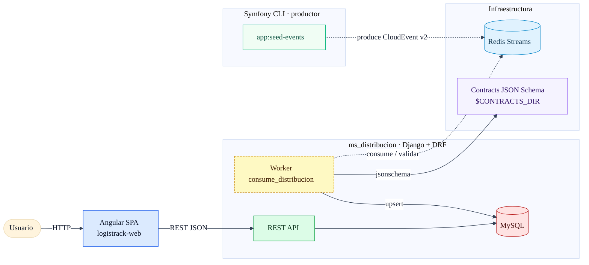

# DOCUMENTACION

> Proyecto: **LogisTrack** – stack Docker (Django + Worker + Symfony CLI + Angular + MySQL + Redis).  
> Enfoque: **Arquitectura Limpia** + **DDD** + principios **SOLID**. Front con **Angular** (standalone components) y **Tailwind** separando lógica de plantilla.

---

## 1) ¿Cómo se resolvió la prueba?

1. **Modelado DDD del contexto “distribución”**  
   - Entidades principales: `Orden`, `Bolsa`, `Bloque`, `Recepcion`, `Distribucion`, catálogos (`Pyme`, `CentroDistribucion`, `Chofer`, `Producto`).  
   - **Desnormalización controlada**: se agregó `Bloque.chofer_nombre` para optimizar listados.
2. **API de lectura/escritura con Django + DRF**  
   - Endpoints bajo `api/v1` (despacho, preparación, consolidación, recepción, distribución).  
   - Esquema OpenAPI con `drf-spectacular` y CORS para el SPA.
3. **Ingesta de eventos con Redis Streams**  
   - Comando de Symfony (`php bin/console app:seed-events`) **publica** eventos *CloudEvent v2*.  
   - Un **worker Django** (`python manage.py consume_distribucion`) **consume**, **valida** (JSON Schema) y **proyecta** en el read‑model.  
   - Idempotencia mediante `EventOffset`.
4. **Contratos como fuente de verdad**  
   - Schemas JSON versionados en `logistrack-contracts` y montados Read‑Only en `/contracts/schemas`.
5. **Datos de prueba**  
   - **Factory** (`distribucion/factory.py`) para poblar casos básicos.  
   - Migraciones + seed ejecutables desde el contenedor Django.
6. **Frontend Angular**  
   - SPA con **Tailwind**, componentes standalone y separación de lógica/plantilla.  
   - Proxy hacia el backend en desarrollo.
7. **Contenerización**  
   - `docker-compose.yml` orquesta: `mysql`, `redis`, `ms_distribucion` (API), `ms_distribucion_worker` (eventos), `symfony_cli` (CLI de eventos), `logistrack_web` (SPA).

**Diagrama (alto nivel)**



---

## 2) Decisiones técnicas y arquitectura general

- **Arquitectura Limpia / DDD**
  - Paquetes: `domain/` (modelos de dominio), `application/` (servicios de caso de uso), `infrastructure/` (repositorios/adaptadores), `api/` (DRF), `management/` (comandos), `contracts/` (validación CE), `tests/`.
  - **Separación de responsabilidades** (SOLID): controladores finos, lógica en *application services*, acceso a datos vía *repositorios*.
- **Persistencia: MySQL** con índices por acceso: (`pyme`,`fecha_despacho`), (`destino_cd`,`fecha_despacho`), `estado_preparacion` en `Orden`, etc.
- **Eventos**: Redis Streams para desacoplar productor/consumidor. Validación con JSON Schema (contracts versionados).
- **Desnormalización**: `chofer_nombre` en `Bloque` para mejorar performance de listados y evitar `JOIN` al chofer en vistas.
- **Contenedores**: Gunicorn en API; worker independiente; CLI PHP solo para *seed/publisher*. Montaje RO de contratos.
- **Frontend**: Angular con **Tailwind**; directivas y componentes con lógica desacoplada de la vista; diseño responsive.
- **Observabilidad básica**: logging a `stdout`, `RequestIdMiddleware`, salud en `/api/v1/health`.
- **Readme y Diagramas**: `docs/arquitectura.md`, `docs/db-diagram.md` (Mermaid).

---

## 3) Herramientas de IA utilizadas

- **ChatGPT‑5 Thinking** (*“chatgpt5”*) para:  
  - Borradores de `docker-compose`, Dockerfiles y comandos de arranque.  
  - Diagramas **Mermaid** (flowcharts, ERD).  
  - Redacción de documentación y checklist de *best practices*.  
  - Soporte puntual en decisiones de arquitectura, pruebas y validaciones.
- **Criterios**: **toda** salida fue revisada y adaptada al contexto del dominio; se mantuvo control de versiones en el repo.

---

## 4) Retos y soluciones

- **Render de Mermaid en GitHub**  
  - Problema: errores por paréntesis/`<br/>` y etiquetas en aristas.  
  - Solución: usar versión *GitHub-safe* (escape `&#40;` `&#41;`, `<br>`, `|label|` en aristas, un gráfico por bloque).
- **Inicialización de datos vs arranque del API**  
  - Problema: ejecutar migraciones/seed sin bloquear el servicio.  
  - Solución: `command` del contenedor Django encadena `migrate` + `factory` + Gunicorn; el worker se levanta aparte.
- **Validación de eventos**  
  - Problema: garantizar conformidad CE v2 / schema JSON.  
  - Solución: contratos en volumen RO y validador centralizado antes de proyectar al read‑model; `EventOffset` para idempotencia.
- **Performance en listados**  
  - Problema: evitar `JOIN`s innecesarios.  
  - Solución: **desnormalización** de `chofer_nombre` + índices en campos de filtrado.
- **Datos de prueba representativos**  
  - Problema: cubrir casos mínimos reales.  
  - Solución: **factory** para pymes, CDs, órdenes, bolsas y bloques; escenarios básicos reproducibles.

---

### Repositorio
- Código y contratos: https://github.com/dreamerdh76/logistrack/

### Estructura (resumen)
```
docs/                 # Diagramas y documentación
logistrack-web/       # Angular (Tailwind, standalone components)
ms_distribucion/      # Django (domain, application, infrastructure, api, management, tests)
symfony-backend/      # Productor de eventos (CLI)
logistrack-contracts/ # JSON Schemas (contracts)
docker-compose.yml    # Orquestación local
```
