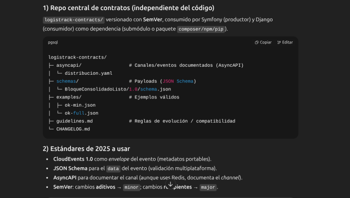
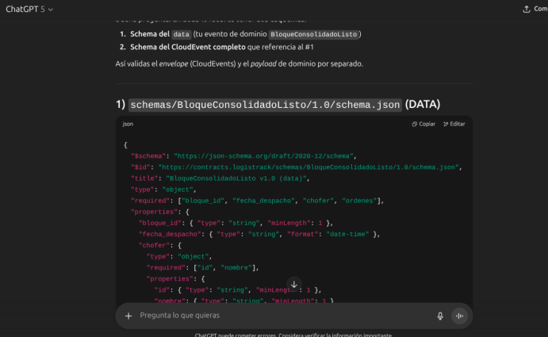
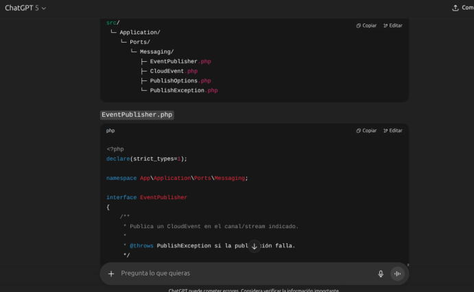

# IA_INTERACCIONES

_Generado automáticamente el 2025-08-16 22:21:29_

Este documento resume las interacciones con IA para la prueba técnica **LogisTrack**.

---

## Interacción 1 — Contexto general

**Transcripción / extracto:**

```plaintext
Interacciones con la ia(chatgpt 5):
```

---

## Interacción 2 — Buscar el estandar a la hora  de definir los contratos

**Captura 1:**


---

## Interacción 3 — Generar la primera version del contrato

**Captura 2:**


---

## Interacción 4 — crear las versiones iniciales de mis puertos
**Captura 3:**

---

## Interacción 5 — genrear la  primera version del validator y lodaer para el contrato1) Apunta Django al directorio de contratos

**Transcripción / extracto:**

```plaintext
En ms_distribucion/ms_distribucion/settings.py:
import osfrom pathlib import Path
BASE_DIR = Path(__file__).resolve().parent.parent
LOGISTRACK_CONTRACTS_DIR = os.getenv(
"LOGISTRACK_CONTRACTS_DIR",
str(BASE_DIR.parent / "logistrack-contracts")  # hermano por defecto
)
Opcional (archivo .env o variables del contenedor):
LOGISTRACK_CONTRACTS_DIR=/ruta/absoluta/a/logistrack-contracts
2) Loader de esquemas (usa la ruta anterior)
Crea ms_distribucion/distribucion/contracts/loader.py:
from pathlib import Pathfrom functools import lru_cacheimport jsonfrom django.conf import settings
CONTRACTS_DIR = Path(settings.LOGISTRACK_CONTRACTS_DIR)
@lru_cache(maxsize=32)def load_schema_by_uri(uri: str) -> dict:
"""
Resuelve URIs del dataschema a archivos locales del repo de contratos.
Soporta:
- .../BloqueConsolidadoListo/1.0/schema.json
- .../BloqueConsolidadoListo/1.0/cloudevent.json
- file:///ruta/absoluta/al/schema.json
"""
schema_root = CONTRACTS_DIR / "schemas" / "BloqueConsolidadoListo" / "1.0"
if uri.endswith("BloqueConsolidadoListo/1.0/schema.json"):
return json.loads((schema_root / "schema.json").read_text(encoding="utf-8"))
if uri.endswith("BloqueConsolidadoListo/1.0/cloudevent.json"):
return json.loads((schema_root / "cloudevent.json").read_text(encoding="utf-8"))
if uri.startswith("file://"):
return json.loads(Path(uri[7:]).read_text(encoding="utf-8"))
raise FileNotFoundError(f"No se reconoce el schema: {uri}")
3) Validador (igual, solo cambia import del loader)
ms_distribucion/distribucion/contracts/validator.py:
from functools import lru_cachefrom jsonschema import Draft202012Validator, FormatCheckerfrom jsonschema.exceptions import ValidationErrorfrom .loader import load_schema_by_uri
class ContractError(Exception): ...
@lru_cache(maxsize=8)def _validator(schema: dict) -> Draft202012Validator:
return Draft202012Validator(schema, format_checker=FormatChecker())
def validate_cloudevent(evt: dict) -> None:
schema = load_schema_by_uri(".../BloqueConsolidadoListo/1.0/cloudevent.json")
try:
_validator(schema).validate(evt)
except ValidationError as e:
raise ContractError(f"CloudEvent inválido: {e.message} @ {'/'.join(map(str,e.path))}")
def validate_data(data: dict, dataschema_uri: str) -> None:
schema = load_schema_by_uri(dataschema_uri)
try:
_validator(schema).validate(data)
except ValidationError as e:
raise ContractError(f"Data inválida: {e.message} @ {'/'.join(map(str,e.path))}")
```

---

## Interacción 6 — Objetivo genrar la primera version de los modelosPensó durante 22s

**Transcripción / extracto:**

```plaintext
Va el read-model mínimo (Django) para cubrir Despacho, Preparación, Expedición, Recepción, Consolidación y Distribución, con idempotencia.
# distribucion/models.pyfrom django.db import models
# -------- Choices (catálogos simples) --------class EstadoPreparacion(models.TextChoices):
PENDIENTE = "PEN", "Pendiente"
COMPLETA  = "COM", "Completa"
class EstadoCompletitudBloque(models.TextChoices):
INCOMPLETO = "INC", "Incompleto"
COMPLETO   = "COM", "Completo"
class EstadoDistribucion(models.TextChoices):
PENDIENTE = "PEN", "Pendiente"
ENTREGADA = "ENT", "Entregada"
RECHAZADA = "REJ", "Rechazada"
# -------- Base --------class TimeStamped(models.Model):
created_at = models.DateTimeField(auto_now_add=True)
updated_at = models.DateTimeField(auto_now=True)
class Meta:
abstract = True
# -------- Catálogos mínimos --------class Chofer(TimeStamped):
id = models.CharField(primary_key=True, max_length=64)          # viene del evento
nombre = models.CharField(max_length=200)
def __str__(self): return self.nombre
# (opcionales, si los usarás en la UI con nombre)class Pyme(TimeStamped):
id = models.CharField(primary_key=True, max_length=64)
nombre = models.CharField(max_length=200)
class CentroDistribucion(TimeStamped):
id = models.CharField(primary_key=True, max_length=64)
nombre = models.CharField(max_length=200)
# -------- Read-model de órdenes --------class Orden(TimeStamped):
id = models.CharField(primary_key=True, max_length=64)
pyme_id = models.CharField(max_length=64, db_index=True)
origen_cd_id = models.CharField(max_length=64, db_index=True)
destino_cd_id = models.CharField(max_length=64, db_index=True)
fecha_despacho = models.DateTimeField(db_index=True)
estado_preparacion = models.CharField(
max_length=3, choices=EstadoPreparacion.choices, default=EstadoPreparacion.PENDIENTE, db_index=True
)
peso_total = models.DecimalField(max_digits=12, decimal_places=3, default=0)
volumen_total = models.DecimalField(max_digits=12, decimal_places=6, default=0)
# asignación (expedición/distribución); no siempre viene en el evento
chofer = models.ForeignKey(Chofer, null=True, blank=True, on_delete=models.SET_NULL, related_name="ordenes")
class Meta:
indexes = [
models.Index(fields=["pyme_id", "fecha_despacho"]),
models.Index(fields=["destino_cd_id", "fecha_despacho"]),
]
class OrdenProducto(models.Model):
orden = models.ForeignKey(Orden, on_delete=models.CASCADE, related_name="productos")
sku = models.CharField(max_length=64)
qty = models.PositiveIntegerField()
peso = models.DecimalField(max_digits=12, decimal_places=3, default=0)
volumen = models.DecimalField(max_digits=12, decimal_places=6, default=0)
class Meta:
unique_together = [("orden", "sku")]
# -------- Consolidación (bloques) --------class Bloque(TimeStamped):
id = models.CharField(primary_key=True, max_length=64)
fecha = models.DateTimeField(db_index=True)
chofer = models.ForeignKey(Chofer, on_delete=models.PROTECT, related_name="bloques")
# denormalizado para listar rápido
chofer_nombre = models.CharField(max_length=200)
total_ordenes = models.PositiveIntegerField(default=0)
estado_completitud = models.CharField(
max_length=3, choices=EstadoCompletitudBloque.choices, default=EstadoCompletitudBloque.INCOMPLETO, db_index=True
)
class Meta:
indexes = [
models.Index(fields=["fecha"]),
models.Index(fields=["chofer", "estado_completitud"]),
]
class BloqueOrden(models.Model):
bloque = models.ForeignKey(Bloque, on_delete=models.CASCADE, related_name="bloque_ordenes")
orden = models.ForeignKey(Orden, on_delete=models.PROTECT, related_name="en_bloques")
class Meta:
unique_together = [("bloque", "orden")]
# -------- Recepción --------class Recepcion(TimeStamped):
orden = models.OneToOneField(Orden, on_delete=models.CASCADE, related_name="recepcion")
cd_id = models.CharField(max_length=64, db_index=True)
fecha_recepcion = models.DateTimeField(db_index=True)
usuario_receptor = models.CharField(max_length=120)
incidencias = models.BooleanField(default=False)
class Meta:
indexes = [models.Index(fields=["cd_id", "fecha_recepcion", "incidencias"])]
# -------- Distribución (última milla) --------class Distribucion(TimeStamped):
orden = models.OneToOneField(Orden, on_delete=models.CASCADE, related_name="distribucion")
estado = models.CharField(max_length=3, choices=EstadoDistribucion.choices, db_index=True)
fecha_entrega = models.DateTimeField(null=True, blank=True, db_index=True)
chofer = models.ForeignKey(Chofer, null=True, blank=True, on_delete=models.SET_NULL)
class Meta:
indexes = [
models.Index(fields=["estado", "fecha_entrega"]),
models.Index(fields=["chofer", "estado"]),
]
# -------- Idempotencia (event processing) --------class EventOffset(models.Model):
event_id = models.CharField(primary_key=True, max_length=128)   # CloudEvent.id
processed_at = models.DateTimeField(auto_now_add=True)
```

---

## Interacción 7 — Objetivo generar una version inicial de  los serializers , filters y view en base a los modelosdistribucion/api/serializers.py

**Transcripción / extracto:**

```plaintext
from rest_framework import serializersfrom distribucion.models import Orden, OrdenProducto, Bloque, BloqueOrden, Recepcion, Distribucion
class OrdenProductoSerializer(serializers.ModelSerializer):
class Meta:
model = OrdenProducto
fields = ("sku","qty","peso","volumen")
class OrdenSerializer(serializers.ModelSerializer):
class Meta:
model = Orden
fields = (
"id","pyme_id","origen_cd_id","destino_cd_id","fecha_despacho",
"estado_preparacion","peso_total","volumen_total","chofer_id"
)
class RecepcionSerializer(serializers.ModelSerializer):
orden_id = serializers.CharField(source="orden_id")
class Meta:
model = Recepcion
fields = ("orden_id","cd_id","fecha_recepcion","usuario_receptor","incidencias")
class DistribucionSerializer(serializers.ModelSerializer):
orden_id = serializers.CharField(source="orden_id")
class Meta:
model = Distribucion
fields = ("orden_id","estado","fecha_entrega","chofer_id")
class BloqueListSerializer(serializers.ModelSerializer):
class Meta:
model = Bloque
fields = ("id","fecha","chofer_id","chofer_nombre","total_ordenes","estado_completitud")
class BloqueDetailSerializer(serializers.ModelSerializer):
ordenes = serializers.SerializerMethodField()
class Meta:
model = Bloque
fields = ("id","fecha","chofer_id","chofer_nombre","total_ordenes","estado_completitud","ordenes")
def get_ordenes(self, obj):
qs = Orden.objects.filter(en_bloques__bloque_id=obj.id).only(
"id","pyme_id","origen_cd_id","destino_cd_id","fecha_despacho","chofer_id","estado_preparacion"
)
return OrdenSerializer(qs, many=True).data
distribucion/api/filters.py
import django_filters as dffrom django.utils import timezonefrom datetime import datetime, timedeltafrom distribucion.models import Orden, Bloque, Recepcion, Distribucion
class RangoFechaMixin:
desde = df.IsoDateTimeFilter(field_name="fecha_despacho", lookup_expr="gte")
hasta = df.IsoDateTimeFilter(field_name="fecha_despacho", lookup_expr="lte")
# Despachoclass DespachoOrdenFilter(RangoFechaMixin, df.FilterSet):
cd_id = df.CharFilter(method="by_cd")          # origen o destino
pyme_id = df.CharFilter(field_name="pyme_id", lookup_expr="exact")
class Meta:
model = Orden
fields = ("cd_id","pyme_id","desde","hasta")
def by_cd(self, qs, name, value):
return qs.filter(df.filters.Q_or(df.filters.Q(**{"origen_cd_id": value}), df.filters.Q(**{"destino_cd_id": value})))
# Preparaciónclass PreparacionOrdenFilter(RangoFechaMixin, df.FilterSet):
estado = df.CharFilter(field_name="estado_preparacion", lookup_expr="exact")
class Meta:
model = Orden
fields = ("estado","desde","hasta")
# Expedición (ordenes con chofer asignado)class ExpedicionOrdenFilter(df.FilterSet):
chofer_id = df.CharFilter(field_name="chofer_id", lookup_expr="exact")
fecha = df.DateFilter(method="por_dia")
class Meta:
model = Orden
fields = ("chofer_id","fecha")
def por_dia(self, qs, name, value):
start = datetime.combine(value, datetime.min.time(), tzinfo=timezone.get_current_timezone())
end   = start + timedelta(days=1)
return qs.filter(fecha_despacho__gte=start, fecha_despacho__lt=end)
# Recepciónclass RecepcionFilter(df.FilterSet):
cd_id = df.CharFilter(field_name="cd_id", lookup_expr="exact")
incidencias = df.BooleanFilter(field_name="incidencias")
desde = df.IsoDateTimeFilter(field_name="fecha_recepcion", lookup_expr="gte")
hasta = df.IsoDateTimeFilter(field_name="fecha_recepcion", lookup_expr="lte")
class Meta:
model = Recepcion
fields = ("cd_id","incidencias","desde","hasta")
# Consolidaciónclass BloqueFilter(df.FilterSet):
fecha = df.DateFilter(method="por_dia")
chofer_id = df.CharFilter(field_name="chofer_id", lookup_expr="exact")
estado = df.CharFilter(field_name="estado_completitud", lookup_expr="exact")
class Meta:
model = Bloque
fields = ("fecha","chofer_id","estado")
def por_dia(self, qs, name, value):
start = datetime.combine(value, datetime.min.time(), tzinfo=timezone.get_current_timezone())
end   = start + timedelta(days=1)
return qs.filter(fecha__gte=start, fecha__lt=end)
# Distribuciónclass DistribucionFilter(df.FilterSet):
estado = df.CharFilter(field_name="estado", lookup_expr="exact")
chofer_id = df.CharFilter(field_name="chofer_id", lookup_expr="exact")
desde = df.IsoDateTimeFilter(field_name="fecha_entrega", lookup_expr="gte")
hasta = df.IsoDateTimeFilter(field_name="fecha_entrega", lookup_expr="lte")
class Meta:
model = Distribucion
fields = ("estado","chofer_id","desde","hasta")
distribucion/api/views.py
from rest_framework import genericsfrom distribucion.models import Orden, Bloque, Recepcion, Distribucionfrom .serializers import (
OrdenSerializer, BloqueListSerializer, BloqueDetailSerializer,
RecepcionSerializer, DistribucionSerializer
)from .filters import (
DespachoOrdenFilter, PreparacionOrdenFilter, ExpedicionOrdenFilter,
BloqueFilter, RecepcionFilter, DistribucionFilter
)
# Despachoclass DespachoOrdenList(generics.ListAPIView):
queryset = Orden.objects.all().order_by("-fecha_despacho")
serializer_class = OrdenSerializer
filterset_class = DespachoOrdenFilter
ordering_fields = ["fecha_despacho","pyme_id","origen_cd_id","destino_cd_id"]
# Preparaciónclass PreparacionOrdenList(generics.ListAPIView):
queryset = Orden.objects.all().order_by("-fecha_despacho")
serializer_class = OrdenSerializer
filterset_class = PreparacionOrdenFilter
ordering_fields = ["fecha_despacho","estado_preparacion"]
# Expediciónclass ExpedicionOrdenList(generics.ListAPIView):
queryset = Orden.objects.exclude(chofer_id__isnull=True).order_by("-fecha_despacho")
serializer_class = OrdenSerializer
filterset_class = ExpedicionOrdenFilter
ordering_fields = ["fecha_despacho","chofer_id"]
# Recepciónclass RecepcionOrdenList(generics.ListAPIView):
queryset = Recepcion.objects.select_related("orden").order_by("-fecha_recepcion")
serializer_class = RecepcionSerializer
filterset_class = RecepcionFilter
ordering_fields = ["fecha_recepcion","cd_id","incidencias"]
# Consolidaciónclass BloqueList(generics.ListAPIView):
queryset = Bloque.objects.all().order_by("-fecha")
serializer_class = BloqueListSerializer
filterset_class = BloqueFilter
ordering_fields = ["fecha","chofer_id","estado_completitud","total_ordenes"]
class BloqueDetail(generics.RetrieveAPIView):
queryset = Bloque.objects.all()
serializer_class = BloqueDetailSerializer
lookup_field = "id"
# Distribuciónclass DistribucionOrdenList(generics.ListAPIView):
queryset = Distribucion.objects.select_related("orden").order_by("-fecha_entrega", "-orden__fecha_despacho")
serializer_class = DistribucionSerializer
filterset_class = DistribucionFilter
ordering_fields = ["fecha_entrega","estado","chofer_id"]
```


## Interacción 8 — Objetivo de la conversación: generar los .spec.ts de mis componentes en Angular

**Transcripción / extracto:**

```plaintext
Enlace a la conversación: https://chatgpt.com/share/68a100cf-93dc-800b-83e2-90c62addd19c
```

---
