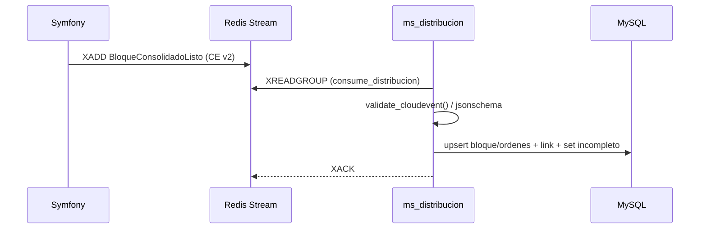

# Arquitectura LogisTrack

## Diagrama de componentes
```mermaid
flowchart LR
  user[Usuario] -->|HTTP| web[Angular SPA<br/>(logistrack-web)]

  subgraph Django[ms_distribucion (Django/DRF)]
    apiD[REST API<br/>/despacho /preparacion /consolidacion /recepcion /expedicion]
    db[(MySQL)]
    apiD --> db
  end

  subgraph Symfony[Backend Symfony (MySQL)]
    apiS[API / Productor de eventos]
    mysql[(MySQL)]
    apiS --> mysql
  end

  subgraph Infra[Infraestructura]
    redis[(Redis Streams)]
    contracts[Contracts JSON Schema<br/>($CONTRACTS_DIR)]
  end

  web -->|REST JSON| apiD
  %% Si tu web también habla directo a Symfony, habilita:
  %% web -->|REST JSON| apiS

  apiS -. produce CloudEvent v2 .-> redis
  redis -. consumer: manage.py consume_distribucion .-> apiD
  apiD -. valida CE (jsonschema) .-> contracts
```

## Flujo de eventos
