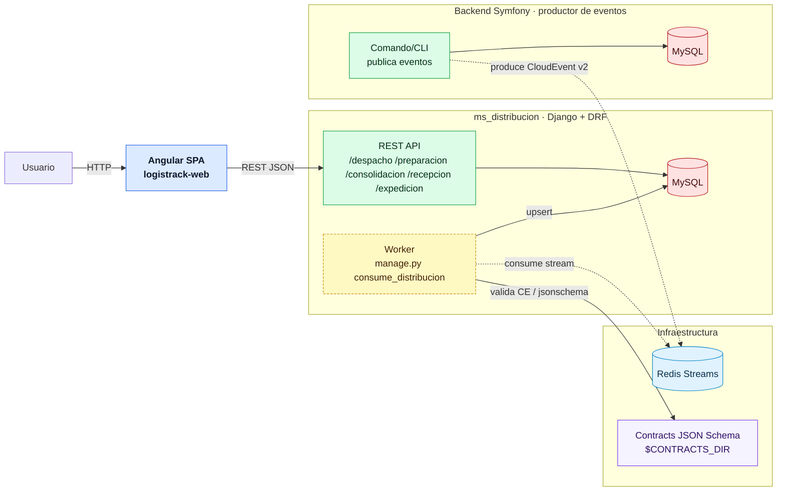
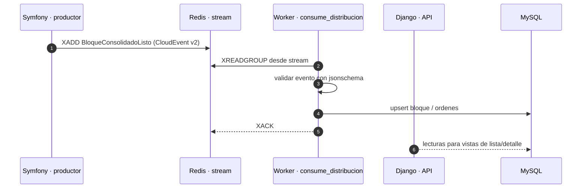

# Arquitectura LogisTrack

## Diagrama de componentes

```mermaid
%%{init: {
  "theme": "base",
  "themeVariables": {
    "primaryColor": "#e5f0ff",
    "primaryBorderColor": "#2563eb",
    "lineColor": "#334155",
    "fontFamily": "Inter, ui-sans-serif, system-ui",
    "clusterBkg": "#f8fafc",
    "clusterBorder": "#94a3b8",
    "edgeLabelBackground":"#ffffff"
}}%%
flowchart LR
  %% Nodos
  user[Usuario]
  web[Angular SPA<br>logistrack-web]
  subgraph Django[ms_distribucion · Django + DRF]
    apiD[REST API<br>/despacho /preparacion /consolidacion /recepcion /expedicion]
    worker[Worker<br>manage.py consume_distribucion]
    db[(MySQL)]
    apiD --> db
  end
  subgraph Symfony[Backend Symfony · productor de eventos]
    apiS[Comando/CLI<br>publica eventos]
    mysql[(MySQL)]
    apiS --> mysql
  end
  subgraph Infra[Infraestructura]
    redis[(Redis Streams)]
    contracts[Contracts JSON Schema<br>$CONTRACTS_DIR]
  end

  %% Flujos
  user -->|HTTP| web
  web -->|REST JSON| apiD
  apiS -.->|produce CloudEvent v2| redis
  worker -.->|consume stream| redis
  worker -->|valida CE / jsonschema| contracts
  worker -->|upsert| db

  %% Estilos
  classDef web fill:#dbeafe,stroke:#2563eb,color:#0f172a,font-weight:bold;
  classDef api fill:#dcfce7,stroke:#16a34a,color:#052e16;
  classDef worker fill:#fef9c3,stroke:#ca8a04,color:#422006,stroke-dasharray: 4 2;
  classDef db fill:#fee2e2,stroke:#b91c1c,color:#450a0a;
  classDef queue fill:#e0f2fe,stroke:#0284c7,color:#082f49;
  classDef contracts fill:#f5f3ff,stroke:#7c3aed,color:#2e1065;

  class web web;
  class apiD,apiS api;
  class worker worker;
  class db,mysql db;
  class redis queue;
  class contracts contracts;

```

## Flujo de eventos

```mermaid
%%{init: {
  "theme": "base",
  "themeVariables": {
    "primaryColor": "#e5f0ff",
    "primaryBorderColor": "#2563eb",
    "fontFamily": "Inter, ui-sans-serif, system-ui"
}}%%
sequenceDiagram
  autonumber
  participant SY as Symfony · productor
  participant RS as Redis · stream
  participant WK as Worker · consume_distribucion
  participant API as Django · API
  participant DB as MySQL

  SY->>RS: XADD BloqueConsolidadoListo (CloudEvent v2)
  WK->>RS: XREADGROUP desde stream
  WK->>WK: validar evento con jsonschema
  WK->>DB: upsert bloque / ordenes
  WK-->>RS: XACK
  API-->>DB: lecturas para vistas de lista/detalle

```
