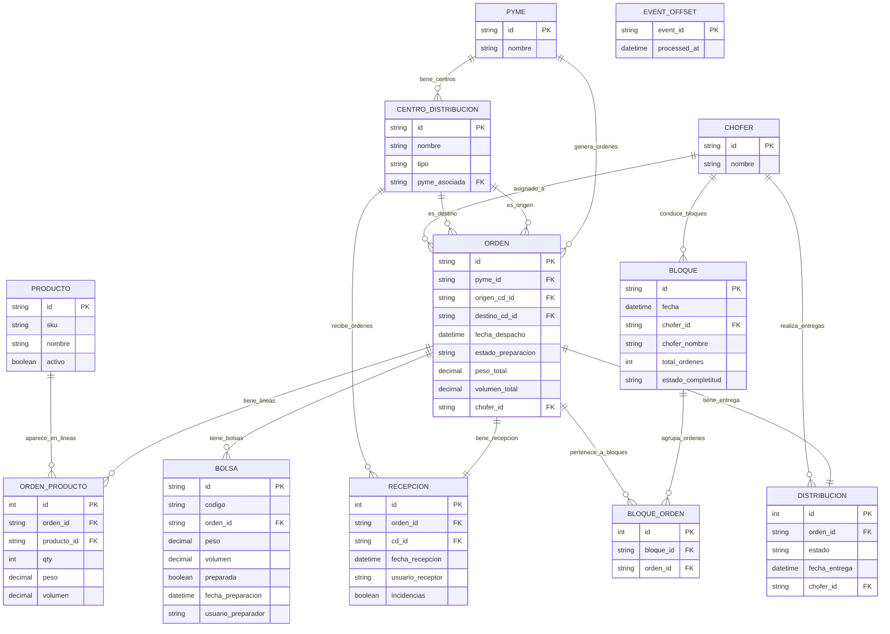
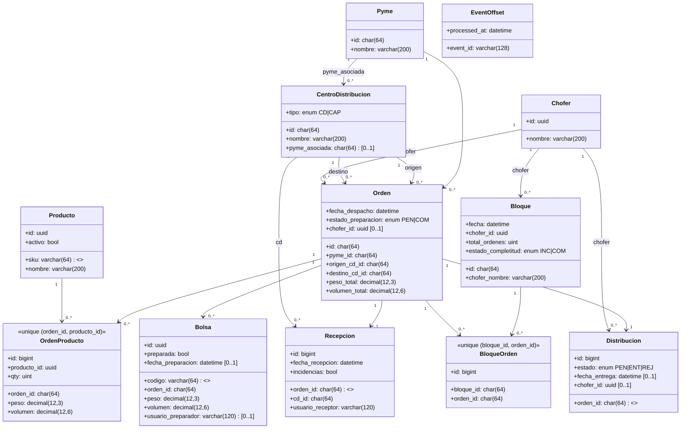

# Modelo de Datos – LogisTrack (Mermaid)

## ERD (erDiagram)

```mermaid
erDiagram
  PYME {
    string id PK
    string nombre
  }

  CENTRO_DISTRIBUCION {
    string id PK
    string nombre
    string tipo
    string pyme_asociada FK
  }

  CHOFER {
    string id PK
    string nombre
  }

  PRODUCTO {
    string id PK
    string sku
    string nombre
    boolean activo
  }

  ORDEN {
    string id PK
    string pyme_id FK
    string origen_cd_id FK
    string destino_cd_id FK
    datetime fecha_despacho
    string estado_preparacion
    decimal peso_total
    decimal volumen_total
    string chofer_id FK
  }

  ORDEN_PRODUCTO {
    int id PK
    string orden_id FK
    string producto_id FK
    int qty
    decimal peso
    decimal volumen
  }

  BOLSA {
    string id PK
    string codigo
    string orden_id FK
    decimal peso
    decimal volumen
    boolean preparada
    datetime fecha_preparacion
    string usuario_preparador
  }

  BLOQUE {
    string id PK
    datetime fecha
    string chofer_id FK
    string chofer_nombre
    int total_ordenes
    string estado_completitud
  }

  BLOQUE_ORDEN {
    int id PK
    string bloque_id FK
    string orden_id FK
  }

  RECEPCION {
    int id PK
    string orden_id FK
    string cd_id FK
    datetime fecha_recepcion
    string usuario_receptor
    boolean incidencias
  }

  DISTRIBUCION {
    int id PK
    string orden_id FK
    string estado
    datetime fecha_entrega
    string chofer_id FK
  }

  EVENT_OFFSET {
    string event_id PK
    datetime processed_at
  }

  PYME ||--o{ CENTRO_DISTRIBUCION : tiene_centros
  PYME ||--o{ ORDEN : genera_ordenes

  CENTRO_DISTRIBUCION ||--o{ ORDEN : es_origen
  CENTRO_DISTRIBUCION ||--o{ ORDEN : es_destino

  CHOFER ||--o{ ORDEN : asignado_a
  ORDEN ||--o{ ORDEN_PRODUCTO : tiene_lineas
  PRODUCTO ||--o{ ORDEN_PRODUCTO : aparece_en_lineas

  ORDEN ||--o{ BOLSA : tiene_bolsas

  CHOFER ||--o{ BLOQUE : conduce_bloques
  BLOQUE ||--o{ BLOQUE_ORDEN : agrupa_ordenes
  ORDEN ||--o{ BLOQUE_ORDEN : pertenece_a_bloques

  ORDEN ||--|| RECEPCION : tiene_recepcion
  CENTRO_DISTRIBUCION ||--o{ RECEPCION : recibe_ordenes

  ORDEN ||--|| DISTRIBUCION : tiene_entrega
  CHOFER ||--o{ DISTRIBUCION : realiza_entregas

```

## Vista alternativa (classDiagram)

```mermaid
classDiagram
  class Pyme {
    +id: char(64)
    +nombre: varchar(200)
  }

  class CentroDistribucion {
    +id: char(64)
    +nombre: varchar(200)
    +tipo: enum CD|CAP
    +pyme_asociada: char(64) [0..1]
  }

  class Chofer {
    +id: uuid
    +nombre: varchar(200)
  }

  class Producto {
    +id: uuid
    +sku: varchar(64) <<unique>>
    +nombre: varchar(200)
    +activo: bool
  }

  class Orden {
    +id: char(64)
    +pyme_id: char(64)
    +origen_cd_id: char(64)
    +destino_cd_id: char(64)
    +fecha_despacho: datetime
    +estado_preparacion: enum PEN|COM
    +peso_total: decimal(12,3)
    +volumen_total: decimal(12,6)
    +chofer_id: uuid [0..1]
  }

  class OrdenProducto {
    +id: bigint
    +orden_id: char(64)
    +producto_id: uuid
    +qty: uint
    +peso: decimal(12,3)
    +volumen: decimal(12,6)
    <<unique (orden_id, producto_id)>>
  }

  class Bolsa {
    +id: uuid
    +codigo: varchar(64) <<unique>>
    +orden_id: char(64)
    +peso: decimal(12,3)
    +volumen: decimal(12,6)
    +preparada: bool
    +fecha_preparacion: datetime [0..1]
    +usuario_preparador: varchar(120) [0..1]
  }

  class Bloque {
    +id: char(64)
    +fecha: datetime
    +chofer_id: uuid
    +chofer_nombre: varchar(200)
    +total_ordenes: uint
    +estado_completitud: enum INC|COM
  }

  class BloqueOrden {
    +id: bigint
    +bloque_id: char(64)
    +orden_id: char(64)
    <<unique (bloque_id, orden_id)>>
  }

  class Recepcion {
    +id: bigint
    +orden_id: char(64) <<unique>>
    +cd_id: char(64)
    +fecha_recepcion: datetime
    +usuario_receptor: varchar(120)
    +incidencias: bool
  }

  class Distribucion {
    +id: bigint
    +orden_id: char(64) <<unique>>
    +estado: enum PEN|ENT|REJ
    +fecha_entrega: datetime [0..1]
    +chofer_id: uuid [0..1]
  }

  class EventOffset {
    +event_id: varchar(128)
    +processed_at: datetime
  }

  Pyme "1" --> "0..*" CentroDistribucion : pyme_asociada
  Pyme "1" --> "0..*" Orden

  CentroDistribucion "1" --> "0..*" Orden : origen
  CentroDistribucion "1" --> "0..*" Orden : destino

  Chofer "1" --> "0..*" Orden : chofer

  Orden "1" --> "0..*" OrdenProducto
  Producto "1" --> "0..*" OrdenProducto

  Orden "1" --> "0..*" Bolsa

  Chofer "1" --> "0..*" Bloque : chofer

  Bloque "1" --> "0..*" BloqueOrden
  Orden "1" --> "0..*" BloqueOrden

  Orden "1" --> "1" Recepcion
  CentroDistribucion "1" --> "0..*" Recepcion : cd

  Orden "1" --> "1" Distribucion
  Chofer "1" --> "0..*" Distribucion : chofer
```
