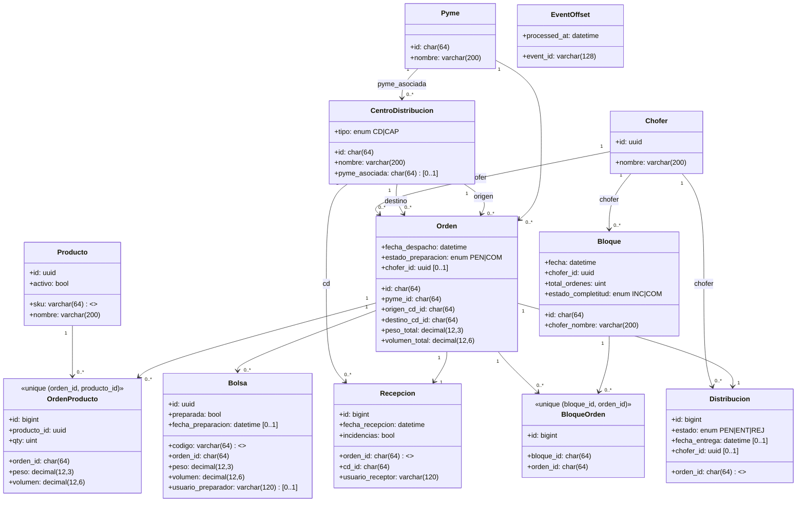

# Modelo de Datos – LogisTrack (Mermaid)

## ERD (erDiagram – compatible con GitHub)
```mermaid
erDiagram
  PYME {
    char64 id PK
    varchar200 nombre
  }

  CENTRO_DISTRIBUCION {
    char64 id PK
    varchar200 nombre
    enum tipo
    char64 pyme_asociada FK NULL
  }

  CHOFER {
    uuid id PK
    varchar200 nombre
  }

  PRODUCTO {
    uuid id PK
    varchar64 sku UK
    varchar200 nombre
    bool activo
  }

  ORDEN {
    char64 id PK
    char64 pyme_id FK
    char64 origen_cd_id FK
    char64 destino_cd_id FK
    datetime fecha_despacho
    enum estado_preparacion
    decimal12_3 peso_total
    decimal12_6 volumen_total
    uuid chofer_id FK NULL
  }

  ORDEN_PRODUCTO {
    bigint id PK
    char64 orden_id FK
    uuid producto_id FK
    uint qty
    decimal12_3 peso
    decimal12_6 volumen
    UK orden_id_producto_id
  }

  BOLSA {
    uuid id PK
    varchar64 codigo UK
    char64 orden_id FK
    decimal12_3 peso
    decimal12_6 volumen
    bool preparada
    datetime fecha_preparacion NULL
    varchar120 usuario_preparador NULL
  }

  BLOQUE {
    char64 id PK
    datetime fecha
    uuid chofer_id FK
    varchar200 chofer_nombre
    uint total_ordenes
    enum estado_completitud
  }

  BLOQUE_ORDEN {
    bigint id PK
    char64 bloque_id FK
    char64 orden_id FK
    UK bloque_id_orden_id
  }

  RECEPCION {
    bigint id PK
    char64 orden_id FK UK
    char64 cd_id FK
    datetime fecha_recepcion
    varchar120 usuario_receptor
    bool incidencias
  }

  DISTRIBUCION {
    bigint id PK
    char64 orden_id FK UK
    enum estado
    datetime fecha_entrega NULL
    uuid chofer_id FK NULL
  }

  EVENT_OFFSET {
    varchar128 event_id PK
    datetime processed_at
  }

  PYME ||--o{ CENTRO_DISTRIBUCION : tiene_centros
  PYME ||--o{ ORDEN : genera_ordenes

  CENTRO_DISTRIBUCION ||--o{ ORDEN : es_origen
  CENTRO_DISTRIBUCION ||--o{ ORDEN : es_destino

  CHOFER ||--o{ ORDEN : asignado_a
  ORDEN ||--o{ ORDEN_PRODUCTO : tiene_lineas
  PRODUCTO ||--o{ ORDEN_PRODUCTO : aparece_en_lineas

  ORDEN ||--o{ BOLSA : tiene_bolsas

  CHOFER ||--o{ BLOQUE : conduce_bloques
  BLOQUE ||--o{ BLOQUE_ORDEN : agrupa_ordenes
  ORDEN ||--o{ BLOQUE_ORDEN : pertenece_a_bloques

  ORDEN ||--|| RECEPCION : tiene_recepcion
  CENTRO_DISTRIBUCION ||--o{ RECEPCION : recibe_ordenes

  ORDEN ||--|| DISTRIBUCION : tiene_entrega
  CHOFER ||--o{ DISTRIBUCION : realiza_entregas
```

## Vista alternativa (classDiagram – fallback)

